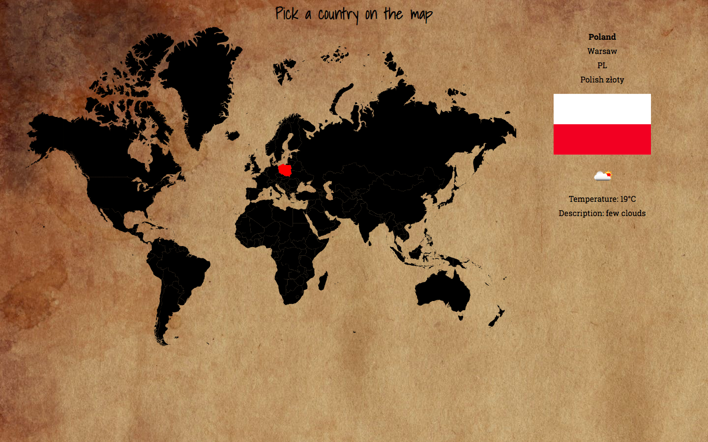

# Countries_API
This project was created in React using [Create React App](https://github.com/facebook/create-react-app)

Clickable world map in SVG format. Click on the country to get country information and weather in capital city.

### Rest API usage
This project uses two API's:
- Weather API from openweathermap
- Country information API from restcountries

When a country on the map is clicked, information is taken from countries API based on the two-letter code. Then weather is matched to the capital city of marked country.

### Screenshots

